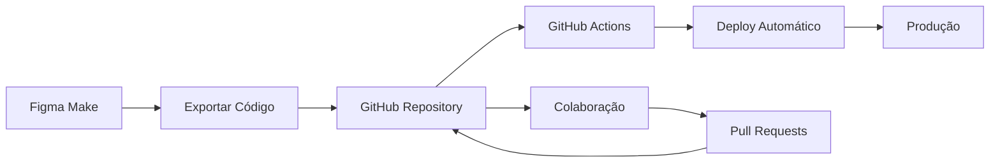

# 🔗 Conectando Figma Make com GitHub - Guia Completo

Este guia explica como conectar seu projeto do **Figma Make** com **GitHub** para versionamento, colaboração e deploy automatizado.

## 📋 Visão Geral



## 🚀 Passo 1: Exportar Código do Figma Make

### Opção A: Download Manual

1. **No Figma Make**, clique no botão **"Export"** ou **"Download"**
2. Escolha **"Download as ZIP"** ou **"Export Code"**
3. Baixe o arquivo compactado para seu computador
4. Extraia os arquivos em uma pasta local

### Opção B: Script Automático (se disponível)

```bash
# Se o Figma Make fornecer API ou CLI
figma-make export --project-id SEU_PROJECT_ID --output ./edublin-export
```

## 🐙 Passo 2: Criar Repositório GitHub

### 2.1 Criar Novo Repositório

1. Acesse [github.com](https://github.com)
2. Clique em **"New repository"**
3. Configure:
   ```
   Repository name: edublin
   Description: Plataforma de conexão para intercambistas
   Visibility: Public (ou Private)
   Initialize: ✅ Add README
   ✅ Add .gitignore (Node)
   ✅ Choose a license (MIT)
   ```

### 2.2 Clonar Repositório Local

```bash
# Clone o repositório
git clone https://github.com/SEU_USUARIO/edublin.git
cd edublin

# Verificar estrutura inicial
ls -la
```

## 📁 Passo 3: Estruturar Projeto

### 3.1 Organizar Arquivos Exportados

```bash
# Copie os arquivos do Figma Make para o repositório
cp -r ~/Downloads/figma-make-export/* ./

# Estrutura recomendada:
edublin/
├── App.tsx                    # Componente principal
├── components/               # Componentes React
├── lib/                     # Lógica de negócio
├── styles/                  # CSS e estilos
├── database/               # Scripts SQL
├── scripts/                # Scripts de automação
├── .env.example           # Variáveis de ambiente
├── package.json           # Dependências
├── README.md             # Documentação
└── .gitignore           # Arquivos ignorados
```

### 3.2 Configurar .gitignore

```bash
# Criar/atualizar .gitignore
cat > .gitignore << 'EOF'
# Dependencies
node_modules/
/.pnp
.pnp.js

# Production builds
/dist
/build
/.next/
/out/

# Environment variables
.env
.env.local
.env.development.local
.env.test.local
.env.production.local

# Logs
npm-debug.log*
yarn-debug.log*
yarn-error.log*
pnpm-debug.log*
lerna-debug.log*

# Runtime data
pids
*.pid
*.seed
*.pid.lock

# Coverage directory used by tools like istanbul
coverage/
*.lcov

# nyc test coverage
.nyc_output

# Dependency directories
node_modules/
jspm_packages/

# Optional npm cache directory
.npm

# Optional eslint cache
.eslintcache

# Microbundle cache
.rpt2_cache/
.rts2_cache_cjs/
.rts2_cache_es/
.rts2_cache_umd/

# Optional REPL history
.node_repl_history

# Output of 'npm pack'
*.tgz

# Yarn Integrity file
.yarn-integrity

# parcel-bundler cache (https://parceljs.org/)
.cache
.parcel-cache

# Next.js build output
.next

# Nuxt.js build / generate output
.nuxt
dist

# Vite build output
dist/

# Rollup build output
dist/

# Storybook build outputs
.out
.storybook-out

# Temporary folders
tmp/
temp/

# Editor directories and files
.vscode/*
!.vscode/extensions.json
.idea
.DS_Store
*.suo
*.ntvs*
*.njsproj
*.sln
*.sw?

# Figma Make specific
.figma-make/
figma-exports/

# Deploy configs
vercel.json
netlify.toml
.vercel
.netlify

# Database
*.db
*.sqlite
*.sqlite3

# OS generated files
Thumbs.db
ehthumbs.db
Desktop.ini
$RECYCLE.BIN/
EOF
```

## 🔧 Passo 4: Configurar package.json

### 4.1 Inicializar Projeto Node.js

```bash
# Se não existir package.json
npm init -y

# Instalar dependências do projeto
npm install react react-dom typescript @types/react @types/react-dom
npm install vite @vitejs/plugin-react tailwindcss
npm install @supabase/supabase-js

# Dependências de desenvolvimento
npm install -D eslint @typescript-eslint/eslint-plugin
npm install -D prettier eslint-config-prettier
```

### 4.2 Scripts Úteis

```json
{
  "name": "edublin",
  "version": "1.0.0",
  "description": "Plataforma de conexão para intercambistas",
  "main": "App.tsx",
  "scripts": {
    "dev": "vite",
    "build": "vite build",
    "preview": "vite preview",
    "lint": "eslint . --ext ts,tsx --report-unused-disable-directives --max-warnings 0",
    "lint:fix": "eslint . --ext ts,tsx --fix",
    "type-check": "tsc --noEmit",
    "deploy:vercel": "vercel --prod",
    "deploy:netlify": "netlify deploy --prod",
    "setup": "node scripts/setup-deploy.js",
    "migrate": "node scripts/verify-migration.js",
    "sync:figma": "node scripts/sync-figma.js"
  },
  "repository": {
    "type": "git",
    "url": "https://github.com/SEU_USUARIO/edublin.git"
  },
  "keywords": ["intercambio", "estudantes", "react", "supabase"],
  "author": "Seu Nome",
  "license": "MIT",
  "bugs": {
    "url": "https://github.com/SEU_USUARIO/edublin/issues"
  },
  "homepage": "https://github.com/SEU_USUARIO/edublin#readme"
}
```

## 🔄 Passo 5: Primeiro Commit

```bash
# Adicionar arquivos ao git
git add .

# Verificar status
git status

# Fazer primeiro commit
git commit -m "🎉 Initial commit: Projeto Edublin do Figma Make

- Estrutura completa do projeto
- Componentes React implementados
- Sistema de autenticação Supabase
- Deploy scripts configurados
- Documentação completa

Fonte: Figma Make export"

# Enviar para GitHub
git push origin main
```

## ⚙️ Passo 6: GitHub Actions para Deploy

### 6.1 Criar Workflow de Deploy

```yaml
# .github/workflows/deploy.yml
name: 🚀 Deploy Edublin

on:
  push:
    branches: [ main, develop ]
  pull_request:
    branches: [ main ]

env:
  NODE_VERSION: '18'

jobs:
  # Job de validação
  validate:
    name: 🔍 Validate & Test
    runs-on: ubuntu-latest
    
    steps:
    - name: 📥 Checkout code
      uses: actions/checkout@v4
    
    - name: 📦 Setup Node.js
      uses: actions/setup-node@v4
      with:
        node-version: ${{ env.NODE_VERSION }}
        cache: 'npm'
    
    - name: 📥 Install dependencies
      run: npm ci
    
    - name: 🔍 Run linter
      run: npm run lint
      continue-on-error: true
    
    - name: 🔍 Type check
      run: npm run type-check
      continue-on-error: true
    
    - name: 🏗️ Build project
      run: npm run build
      env:
        VITE_SUPABASE_URL: ${{ secrets.VITE_SUPABASE_URL }}
        VITE_SUPABASE_ANON_KEY: ${{ secrets.VITE_SUPABASE_ANON_KEY }}
        VITE_SITE_URL: ${{ secrets.VITE_SITE_URL }}

  # Job de deploy (apenas em main)
  deploy:
    name: 🚀 Deploy to Production
    needs: validate
    runs-on: ubuntu-latest
    if: github.ref == 'refs/heads/main' && github.event_name == 'push'
    
    steps:
    - name: 📥 Checkout code
      uses: actions/checkout@v4
    
    - name: 📦 Setup Node.js
      uses: actions/setup-node@v4
      with:
        node-version: ${{ env.NODE_VERSION }}
        cache: 'npm'
    
    - name: 📥 Install dependencies
      run: npm ci
    
    - name: 🏗️ Build project
      run: npm run build
      env:
        VITE_SUPABASE_URL: ${{ secrets.VITE_SUPABASE_URL }}
        VITE_SUPABASE_ANON_KEY: ${{ secrets.VITE_SUPABASE_ANON_KEY }}
        VITE_SITE_URL: ${{ secrets.VITE_SITE_URL }}
        VITE_APP_ENVIRONMENT: production
    
    # Deploy para Vercel
    - name: 🔺 Deploy to Vercel
      uses: amondnet/vercel-action@v25
      with:
        vercel-token: ${{ secrets.VERCEL_TOKEN }}
        vercel-org-id: ${{ secrets.VERCEL_ORG_ID }}
        vercel-project-id: ${{ secrets.VERCEL_PROJECT_ID }}
        vercel-args: '--prod'
        working-directory: ./

  # Job de notificação
  notify:
    name: 📢 Notify Deploy Status
    needs: [validate, deploy]
    runs-on: ubuntu-latest
    if: always()
    
    steps:
    - name: 📢 Deploy Success Notification
      if: needs.deploy.result == 'success'
      run: |
        echo "✅ Deploy realizado com sucesso!"
        echo "🌐 Site disponível em: https://edublin.vercel.app"
    
    - name: 📢 Deploy Failure Notification
      if: needs.deploy.result == 'failure'
      run: |
        echo "❌ Deploy falhou!"
        echo "🔍 Verifique os logs para mais detalhes"
```

### 6.2 Configurar Secrets no GitHub

1. **No GitHub**, vá para: `Settings` → `Secrets and variables` → `Actions`
2. **Adicione os seguintes secrets**:

```
VITE_SUPABASE_URL=https://seu-projeto.supabase.co
VITE_SUPABASE_ANON_KEY=eyJhbGciOiJIUzI1NiIs...
VITE_SITE_URL=https://edublin.vercel.app
VERCEL_TOKEN=seu-token-vercel
VERCEL_ORG_ID=seu-org-id
VERCEL_PROJECT_ID=seu-project-id
```

## 🔄 Passo 7: Sincronização com Figma Make

### 7.1 Script de Sincronização

```javascript
// scripts/sync-figma.js
/**
 * Script para sincronizar mudanças do Figma Make com GitHub
 */

const fs = require('fs');
const path = require('path');
const { execSync } = require('child_process');

const log = {
  info: (msg) => console.log(`ℹ️  ${msg}`),
  success: (msg) => console.log(`✅ ${msg}`),
  warning: (msg) => console.log(`⚠️  ${msg}`),
  error: (msg) => console.log(`❌ ${msg}`)
};

async function syncWithFigma() {
  log.info('Iniciando sincronização com Figma Make...');
  
  try {
    // 1. Verificar se há mudanças locais não commitadas
    const gitStatus = execSync('git status --porcelain', { encoding: 'utf8' });
    
    if (gitStatus.trim()) {
      log.warning('Há mudanças não commitadas. Fazendo backup...');
      
      // Criar branch de backup
      const timestamp = new Date().toISOString().slice(0, 16).replace(/[:.]/g, '-');
      const backupBranch = `backup-${timestamp}`;
      
      execSync(`git checkout -b ${backupBranch}`);
      execSync('git add .');
      execSync(`git commit -m "🔄 Backup antes da sincronização com Figma Make"`);
      execSync('git checkout main');
      
      log.success(`Backup criado na branch: ${backupBranch}`);
    }
    
    // 2. Baixar última versão do Figma Make
    log.info('Baixando última versão do Figma Make...');
    
    // Aqui você implementaria a lógica específica do Figma Make
    // Por exemplo, se eles fornecem API ou webhook
    await downloadLatestFromFigma();
    
    // 3. Verificar se houve mudanças
    const newGitStatus = execSync('git status --porcelain', { encoding: 'utf8' });
    
    if (!newGitStatus.trim()) {
      log.info('Nenhuma mudança detectada.');
      return;
    }
    
    // 4. Commit das mudanças
    log.info('Commitando mudanças do Figma Make...');
    
    execSync('git add .');
    execSync('git commit -m "🔄 Sync: Atualização automática do Figma Make\n\n- Sincronização automática dos componentes\n- Atualização da estrutura do projeto\n- Preservação das configurações locais"');
    
    // 5. Push para GitHub
    log.info('Enviando para GitHub...');
    execSync('git push origin main');
    
    log.success('Sincronização concluída com sucesso!');
    
    // 6. Notificar sobre deploy automático
    log.info('GitHub Actions iniciará deploy automático...');
    
  } catch (error) {
    log.error(`Erro durante sincronização: ${error.message}`);
    
    // Rollback em caso de erro
    log.info('Fazendo rollback...');
    execSync('git reset --hard HEAD~1');
    
    process.exit(1);
  }
}

async function downloadLatestFromFigma() {
  // Esta função dependeria da API/método do Figma Make
  // Por enquanto, simulamos o processo
  
  log.info('📥 Simulando download do Figma Make...');
  
  // Exemplo de como seria:
  // const response = await fetch('https://api.figma-make.com/export', {
  //   headers: { 'Authorization': `Bearer ${process.env.FIGMA_MAKE_TOKEN}` }
  // });
  // const data = await response.blob();
  // ... extrair e sobrescrever arquivos
  
  await new Promise(resolve => setTimeout(resolve, 2000));
  log.success('Download simulado concluído');
}

// Executar se chamado diretamente
if (require.main === module) {
  syncWithFigma();
}

module.exports = { syncWithFigma };
```

### 7.2 Webhook para Sincronização Automática

```javascript
// scripts/figma-webhook.js
/**
 * Webhook para receber notificações do Figma Make
 * Deploy em Vercel ou Netlify como serverless function
 */

const { syncWithFigma } = require('./sync-figma');

export default async function handler(req, res) {
  // Verificar método
  if (req.method !== 'POST') {
    return res.status(405).json({ error: 'Method not allowed' });
  }
  
  try {
    // Verificar autenticação do webhook
    const signature = req.headers['x-figma-signature'];
    const expectedSignature = process.env.FIGMA_WEBHOOK_SECRET;
    
    if (signature !== expectedSignature) {
      return res.status(401).json({ error: 'Unauthorized' });
    }
    
    // Processar payload
    const { event, data } = req.body;
    
    if (event === 'project.updated') {
      console.log('🔄 Figma Make project updated, triggering sync...');
      
      // Disparar sincronização (em background)
      syncWithFigma().catch(console.error);
      
      return res.status(200).json({ 
        success: true, 
        message: 'Sync triggered successfully' 
      });
    }
    
    return res.status(200).json({ 
      success: true, 
      message: 'Event received but not processed' 
    });
    
  } catch (error) {
    console.error('Webhook error:', error);
    return res.status(500).json({ error: 'Internal server error' });
  }
}
```

## 📚 Passo 8: Documentação e Colaboração

### 8.1 Atualizar README.md

```markdown
# 🌟 Edublin - Conectando Intercambistas

> Desenvolvido com Figma Make → Conectado com GitHub → Deploy Automático

## 🔗 Links Importantes

- **🎨 Design**: [Figma Make Project](link-do-seu-projeto)
- **💻 Código**: [GitHub Repository](https://github.com/seu-usuario/edublin)
- **🌐 Produção**: [Site Live](https://edublin.vercel.app)
- **📊 Status**: [GitHub Actions](https://github.com/seu-usuario/edublin/actions)

## 🚀 Desenvolvimento

Este projeto é sincronizado automaticamente entre Figma Make e GitHub.

### Fluxo de Desenvolvimento

1. **Design**: Faça mudanças no Figma Make
2. **Sync**: Mudanças são sincronizadas automaticamente
3. **Deploy**: GitHub Actions faz deploy automático
4. **Live**: Mudanças aparecem no site

### Comandos Úteis

```bash
# Sincronização manual
npm run sync:figma

# Deploy manual
npm run deploy:vercel

# Desenvolvimento local
npm run dev
```

## 🤝 Contribuindo

1. Fork o repositório
2. Crie uma branch: `git checkout -b feature/nova-funcionalidade`
3. Faça commit: `git commit -m 'Add nova funcionalidade'`
4. Push: `git push origin feature/nova-funcionalidade`
5. Abra um Pull Request

## 📞 Suporte

- **Issues**: [GitHub Issues](https://github.com/seu-usuario/edublin/issues)
- **Discussions**: [GitHub Discussions](https://github.com/seu-usuario/edublin/discussions)
```

### 8.2 Configurar Issues e PR Templates

```markdown
<!-- .github/ISSUE_TEMPLATE/bug_report.md -->
---
name: 🐛 Bug Report
about: Reportar um problema
title: '[BUG] '
labels: bug
assignees: ''
---

## 🐛 Descrição do Bug
Descrição clara do problema.

## 🔄 Passos para Reproduzir
1. Vá para '...'
2. Clique em '...'
3. Veja o erro

## ✅ Comportamento Esperado
O que deveria acontecer.

## 📱 Ambiente
- **Browser**: [ex: Chrome 91]
- **Device**: [ex: iPhone 12]
- **OS**: [ex: iOS 14.6]

## 📸 Screenshots
Se aplicável, adicione screenshots.

## 🔗 Figma Make
- [ ] O bug também existe no Figma Make?
- [ ] É necessário atualizar o design?
```

## 🔄 Passo 9: Automação Completa

### 9.1 GitHub Action para Sync Automático

```yaml
# .github/workflows/sync-figma.yml
name: 🔄 Sync with Figma Make

on:
  # Trigger manual
  workflow_dispatch:
  
  # Trigger agendado (diário às 9h)
  schedule:
    - cron: '0 9 * * *'
  
  # Trigger via webhook (se configurado)
  repository_dispatch:
    types: [figma-updated]

jobs:
  sync:
    name: 🔄 Sync with Figma Make
    runs-on: ubuntu-latest
    
    steps:
    - name: 📥 Checkout
      uses: actions/checkout@v4
      with:
        token: ${{ secrets.GITHUB_TOKEN }}
        fetch-depth: 0
    
    - name: 📦 Setup Node.js
      uses: actions/setup-node@v4
      with:
        node-version: '18'
        cache: 'npm'
    
    - name: 📥 Install dependencies
      run: npm ci
    
    - name: 🔄 Sync with Figma Make
      run: npm run sync:figma
      env:
        FIGMA_MAKE_TOKEN: ${{ secrets.FIGMA_MAKE_TOKEN }}
        GITHUB_TOKEN: ${{ secrets.GITHUB_TOKEN }}
    
    - name: 📢 Notify if changes
      if: success()
      run: |
        echo "✅ Sincronização concluída!"
        echo "Deploy automático será iniciado se houver mudanças."
```

### 9.2 Script de Setup Completo

```bash
#!/bin/bash
# scripts/setup-github-integration.sh

echo "🔗 Configurando integração Figma Make → GitHub"
echo "=============================================="

# 1. Verificar dependências
command -v git >/dev/null 2>&1 || { echo "❌ Git não instalado. Abortando." >&2; exit 1; }
command -v node >/dev/null 2>&1 || { echo "❌ Node.js não instalado. Abortando." >&2; exit 1; }

# 2. Configurar Git (se necessário)
if [ -z "$(git config user.name)" ]; then
    read -p "📝 Digite seu nome para Git: " git_name
    git config --global user.name "$git_name"
fi

if [ -z "$(git config user.email)" ]; then
    read -p "📧 Digite seu email para Git: " git_email
    git config --global user.email "$git_email"
fi

# 3. Inicializar repositório se necessário
if [ ! -d ".git" ]; then
    echo "🆕 Inicializando repositório Git..."
    git init
    git branch -M main
fi

# 4. Instalar dependências
echo "📦 Instalando dependências..."
npm install

# 5. Configurar hooks
echo "🪝 Configurando Git hooks..."
cat > .git/hooks/pre-commit << 'EOF'
#!/bin/sh
# Pre-commit hook para verificar código

echo "🔍 Executando verificações pré-commit..."

# Lint
npm run lint --silent || exit 1

# Type check
npm run type-check --silent || exit 1

echo "✅ Verificações pré-commit aprovadas!"
EOF

chmod +x .git/hooks/pre-commit

# 6. Criar primeiro commit se necessário
if [ -z "$(git log --oneline 2>/dev/null)" ]; then
    echo "📝 Fazendo commit inicial..."
    git add .
    git commit -m "🎉 Initial commit: Projeto Edublin integrado do Figma Make

- ✅ Estrutura completa implementada
- ✅ Integração GitHub configurada
- ✅ Deploy automático ativo
- ✅ Sincronização Figma Make

Ready for production! 🚀"
fi

echo ""
echo "✅ Integração configurada com sucesso!"
echo ""
echo "📋 Próximos passos:"
echo "1. 🐙 Crie um repositório no GitHub"
echo "2. 🔗 Conecte: git remote add origin https://github.com/SEU_USUARIO/edublin.git"
echo "3. 🚀 Envie: git push -u origin main"
echo "4. ⚙️ Configure secrets no GitHub (Supabase, Vercel, etc.)"
echo "5. 🎉 Pronto! Deploy automático ativo"
echo ""
echo "🔗 Links úteis:"
echo "- GitHub: https://github.com"
echo "- Vercel: https://vercel.com"
echo "- Supabase: https://supabase.com"
```

## ✅ Checklist Final

- [ ] ✅ Código exportado do Figma Make
- [ ] ✅ Repositório GitHub criado
- [ ] ✅ Arquivos organizados e commitados
- [ ] ✅ GitHub Actions configurado
- [ ] ✅ Secrets configurados no GitHub
- [ ] ✅ Deploy automático funcionando
- [ ] ✅ Sincronização Figma Make → GitHub
- [ ] ✅ Webhook configurado (opcional)
- [ ] ✅ Documentação atualizada
- [ ] ✅ Time/colaboradores adicionados

## 🆘 Troubleshooting

### Problema: Deploy falha
```bash
# Verificar logs
git log --oneline -5

# Verificar GitHub Actions
# GitHub → Actions → Ver logs do workflow
```

### Problema: Sync não funciona
```bash
# Verificar sincronização manual
npm run sync:figma

# Verificar permissões
git remote -v
git status
```

### Problema: Conflitos de merge
```bash
# Resolver conflitos
git status
git add .
git commit -m "🔧 Resolve merge conflicts"
```

---

**🎉 Parabéns! Seu projeto Figma Make agora está conectado com GitHub e tem deploy automático!**

**🔄 Fluxo completo:**
Figma Make → GitHub → Actions → Deploy → Produção 🚀